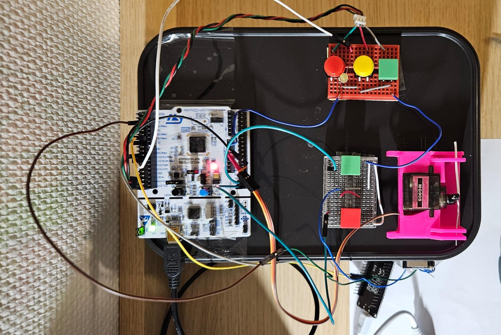
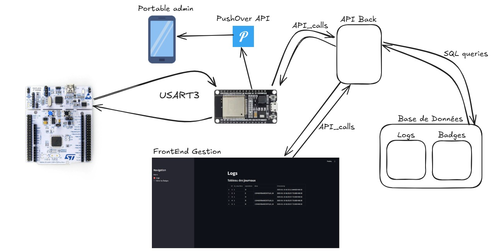

# Gestionnaire-Emprunt-Outils

Ce dépôt contient toutes les ressources de développement pour le projet de Système de Prêt d'Outils. L'objectif est de créer un module complet pour gérer le prêt et le retour de petits outils dans des salles en libre-service, en utilisant la technologie RFID et des mécanismes de verrouillage à servomoteur.

## Lancer le Projet

Pour lancer le projet, suivez les instructions ci-dessous :

### Firmware

1. **Keil v5** : Ouvrez le projet dans Keil v5 pour compiler et téléverser le firmware sur le microcontrôleur. Le fichier du projet se trouve dans le dossier `Firmware/`.

2. **ArduinoIDE** : Ouvrez le projet dans ArduinoIDE pour compiler et téléverser le firmware sur l'ESP32. Le fichier du projet se trouve dans le dossier `Software/firmware_esp/`.

### Software

1. **Naviguer vers le répertoire Software** :
    ```sh
    git clone https://github.com/dan-lara/Gestionnaire-Emprunt-Outils.git
    cd Gestionnaire-Emprunt-Outils/Software
    ```

2. **Installer les dépendances** : Créez un environnement virtuel et installez les dépendances nécessaires :
    ```sh
    python -m venv venv
    source venv/bin/activate  # Sur Windows, utilisez `venv\Scripts\activate`
    pip install -r requirements.txt
    ```

3. **Lancer l'interface Streamlit** :
    ```sh
    streamlit run .\admin_st.py --reload
    ```

4. **Lancer l'API avec Uvicorn** :
    ```sh
    uvicorn admin_api:app --host 0.0.0.0 --port 8000 --reload
    ```

# Architecture du Projet

```
└── 📁Docs
└── 📁Firmware
    └── main.c
    └── adxl345.h
    └── general.h
    └── logs.h
    └── manchester.h
    └── servo.h
    └── spi.h
    └── timer.h
    └── uart.h
└── 📁Hardware
    └── 📁Model3D
    └── 📁SystemRFID
└── 📁Software
    └── admin_api.py
    └── admin_st.py
    └── logs_and_badges.db
    └── tableaux.sql
```
Le projet a été développé sur la base de l'architecture décrite ci-dessus, chaque module étant spécifique à une tâche.

## Docs

Ce répertoire contient des documents généraux tels que le rapport de projet, les manuels d'utilisation, et les liens vers les démonstrations vidéo. Ces documents fournissent une vue d'ensemble du projet, des instructions détaillées pour l'installation et l'utilisation, ainsi que des exemples pratiques.

## Firmware

Le répertoire Firmware contient le projet Keil avec les bibliothèques développées pour mettre en œuvre le projet. Chaque fichier source et en-tête (.c et .h) a une fonction spécifique, comme la gestion des capteurs, la communication SPI, le contrôle des servomoteurs, etc. Ces bibliothèques peuvent être réutilisées ou étendues pour ajouter de nouvelles fonctionnalités à la machine.

## Matériel

Ce répertoire contient les fichiers nécessaires pour le matériel physique du projet. Le dossier Model3D inclut les fichiers STL pour l'impression 3D des supports de servomoteurs et autres composants. Le dossier SystemRFID contient les schémas et les fichiers de simulation pour la carte RFID, permettant de comprendre et de reproduire le système de verrouillage basé sur la technologie RFID.

Voici une image montrant le montage complet du système de prêt d'outils :



## Logiciel

Le répertoire Software contient les scripts et les bases de données nécessaires pour la gestion du système. Les fichiers Python (admin_api.py et admin_st.py) gèrent les API et les interfaces administratives. Le fichier logs_and_badges.db est la base de données SQLite contenant les logs d'emprunt et les informations sur les badges RFID. Le fichier tableaux.sql contient les scripts SQL pour créer et gérer les tables de la base de données. Ces composants permettent la communication avec l'internet, la gestion des données et l'administration du système.


## Description de l'Architecture
Voici une image illustrant l'architecture complète du système :



## Comment Contribuer

Pour ajouter des informations à ce dépôt, suivez ces étapes :

<!-- 1. **Forker le Dépôt** : Cliquez sur le bouton "Fork" en haut à droite de ce dépôt pour créer une copie du dépôt sur votre compte GitHub. -->

<!-- 2. **Cloner le Dépôt Forké** : Clonez le dépôt forké sur votre machine locale en utilisant la commande suivante : -->
2. **Cloner le Dépôt** : Clonez le dépôt sur votre machine locale en utilisant la commande suivante :
    ```sh
    git clone https://github.com/dan-lara/Gestionnaire-Emprunt-Outils.git
    cd Gestionnaire-Emprunt-Outils
    ```

3. **Créer une Nouvelle Branche** : Créez une nouvelle branche pour vos modifications :
    ```sh
    git checkout -b votre-nom-de-branche
    ```

4. **Apporter Vos Modifications** : Ajoutez les informations ou apportez les modifications que vous souhaitez contribuer.

5. **Valider Vos Modifications** : Validez vos modifications avec un message de validation descriptif :
    ```sh
    git add .
    git commit -m "Description des modifications"
    ```

6. **Pousser Vos Modifications** : Poussez vos modifications vers votre dépôt forké :
    ```sh
    git push origin votre-nom-de-branche
    ```

7. **Créer une Pull Request** : Allez sur le dépôt original sur GitHub et cliquez sur le bouton "New Pull Request". Sélectionnez votre branche et soumettez la pull request pour révision.

## Contact

Pour toute question ou problème, veuillez ouvrir une issue sur le dépôt ou contacter les mainteneurs du projet.